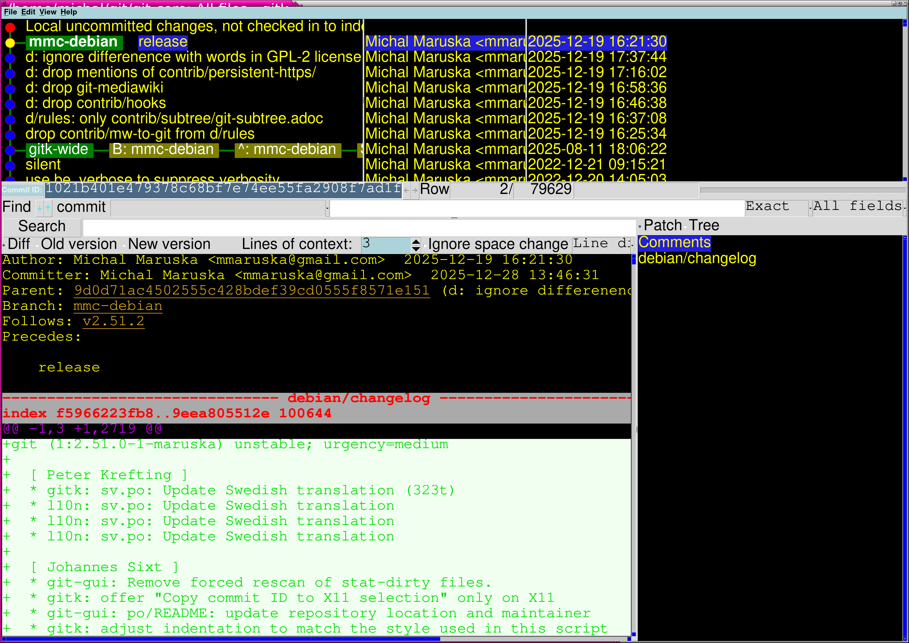
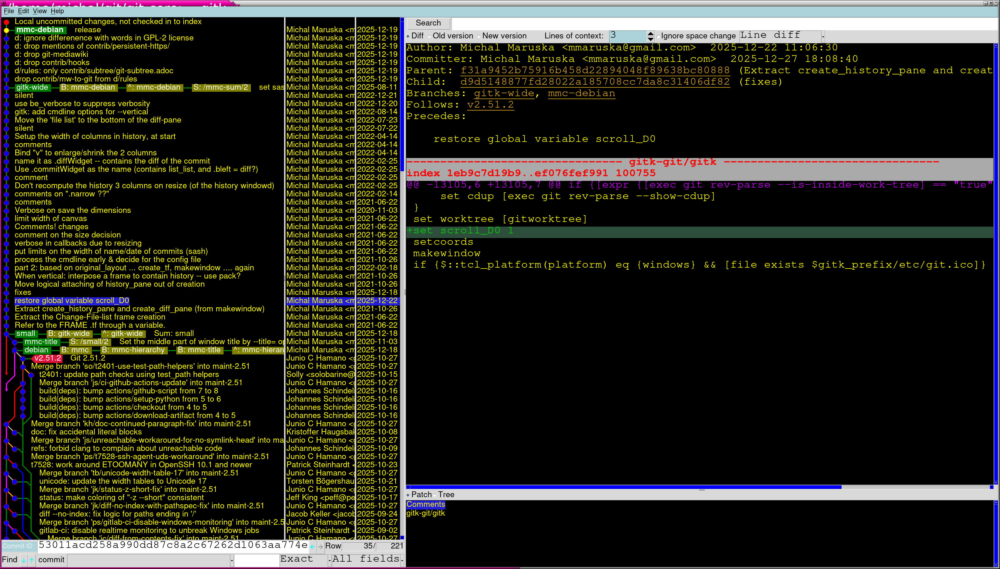

# Gitk on wide displays

## Gitk on wide displays

This is the original layout of gitk:

I realized (years ago) that I want to see more of the code lines, and also the history (just the message).
They are competing for the height, while there is abundant space to the sides. Bad layout.

It's better to keep the narrow history **list** to the side, while the main **diff pane** should use the full height.

The changes are in [gitk-wide branch](https://github.com/MichalMaruska/git/commits/gitk-wide/)
